## API Usage – Screenshots

All endpoints of the application were tested using Swagger UI.

---

### Create Product
POST /api/v1/products

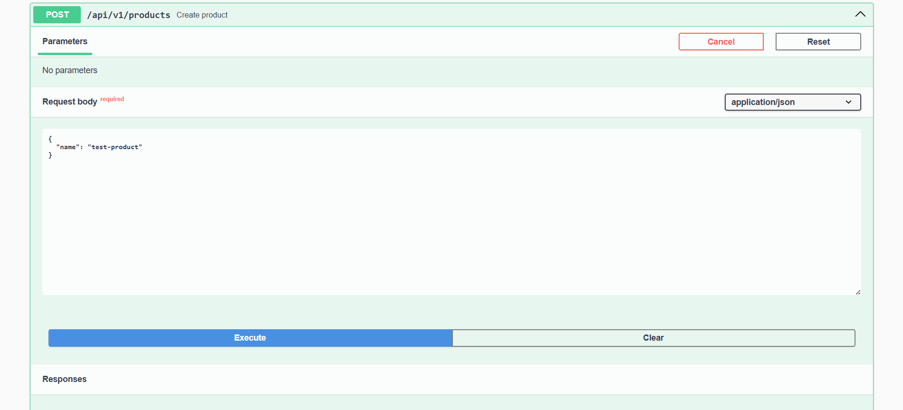
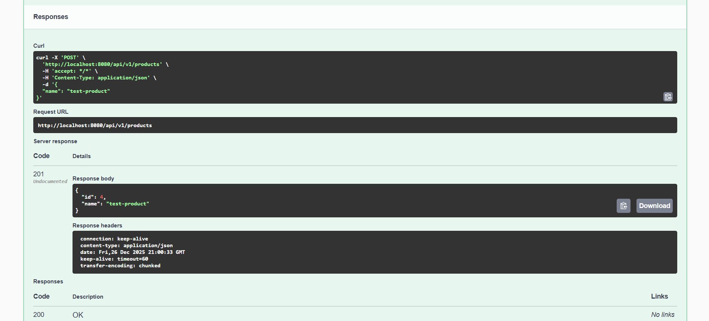

---

### Get All Products
GET /api/v1/products

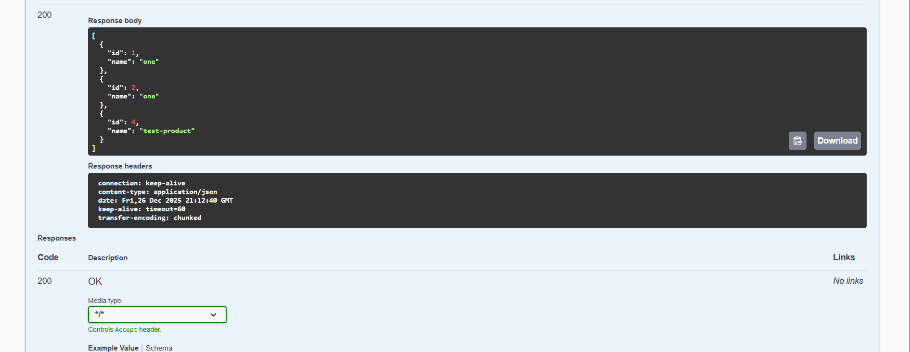
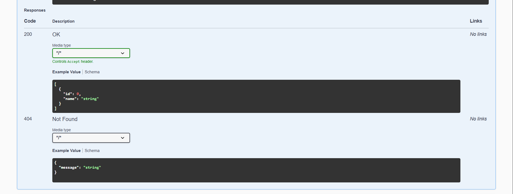

---

### Get Product by ID
GET /api/v1/products/{id}

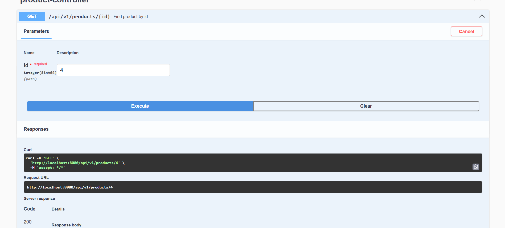
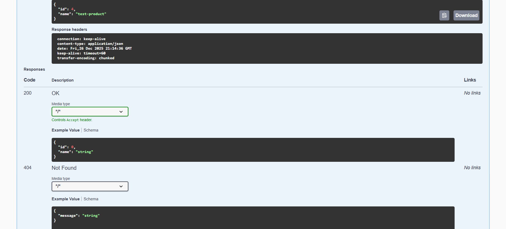

---

### Update Product
PUT /api/v1/products/{id}

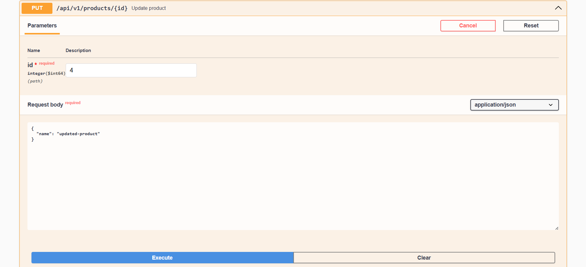
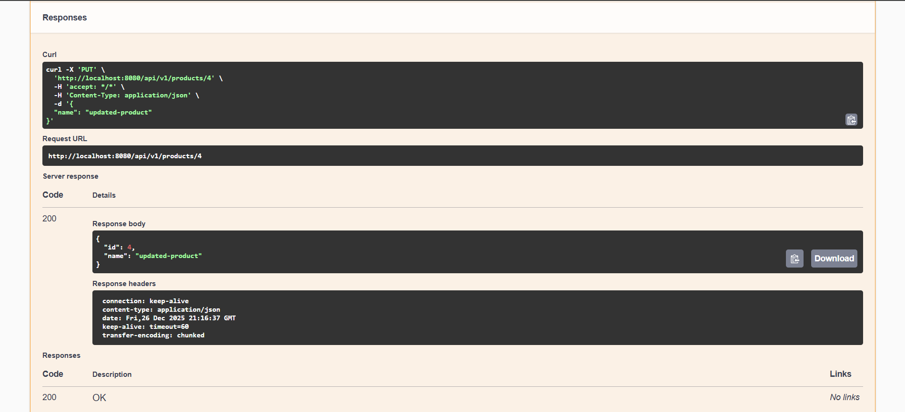
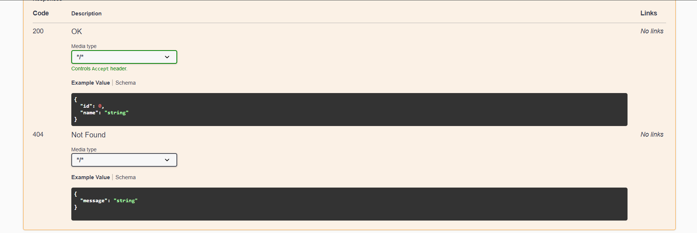

---

### Delete Product
DELETE /api/v1/products/{id}

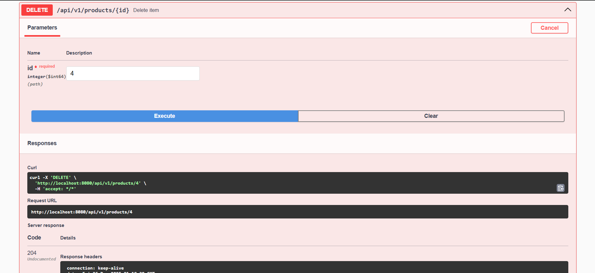
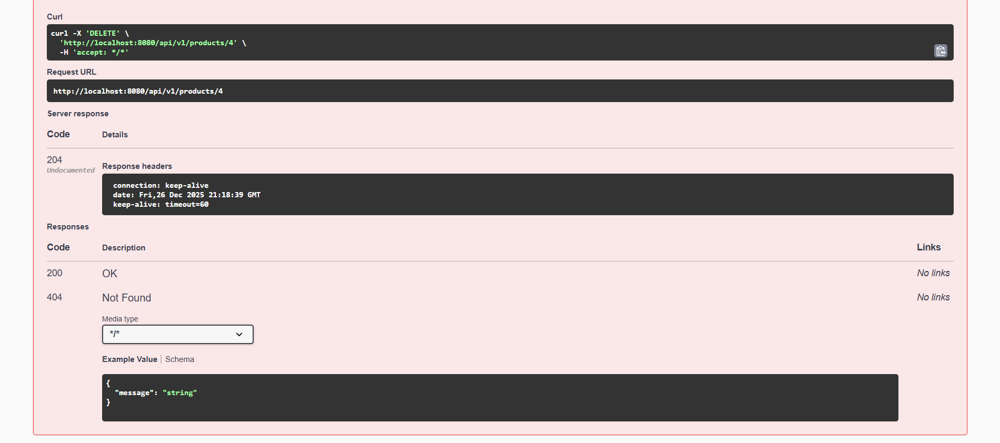

---

### Additional Task – Theory Question

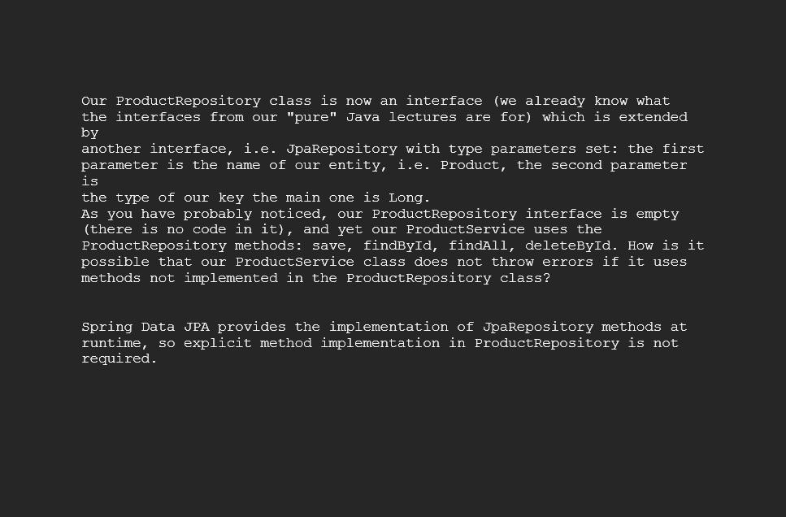
